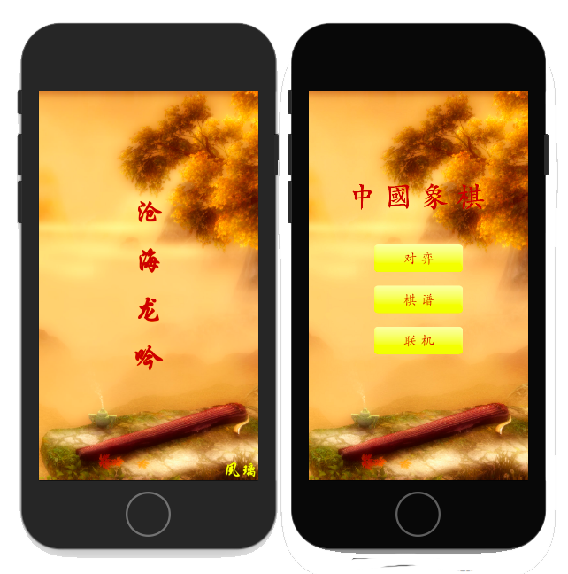
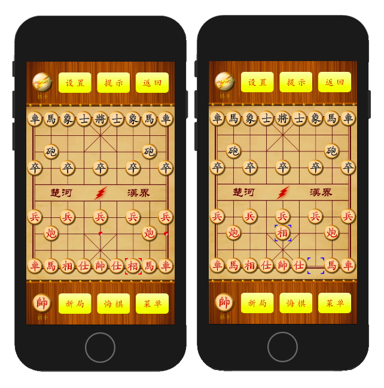
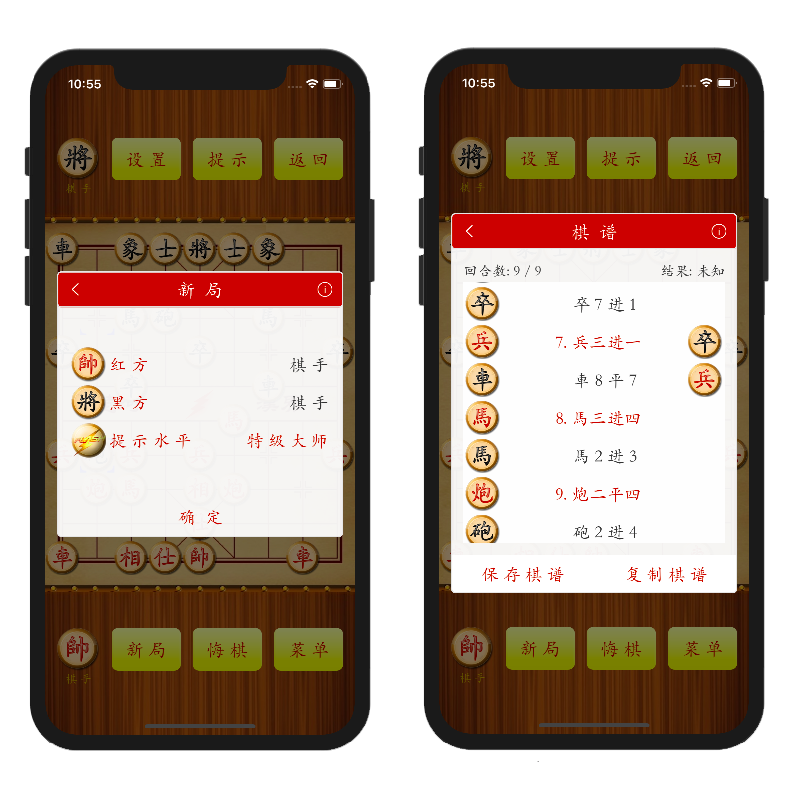
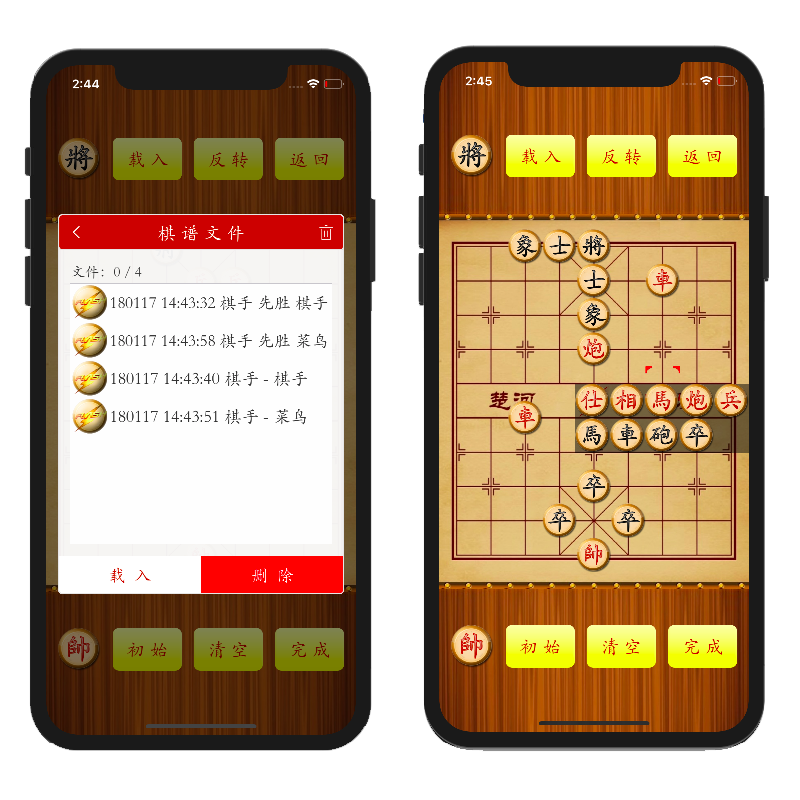
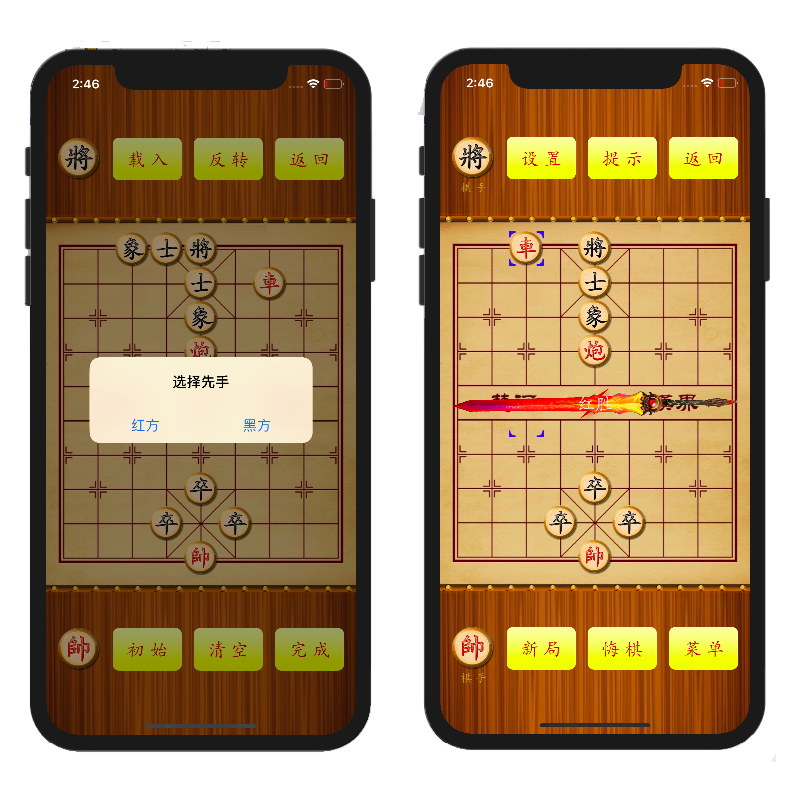
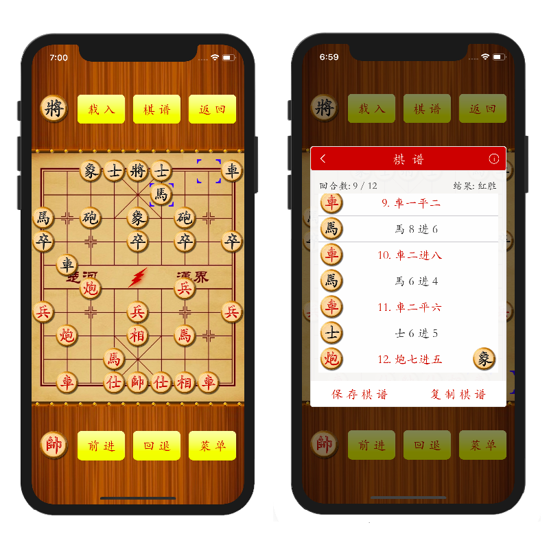
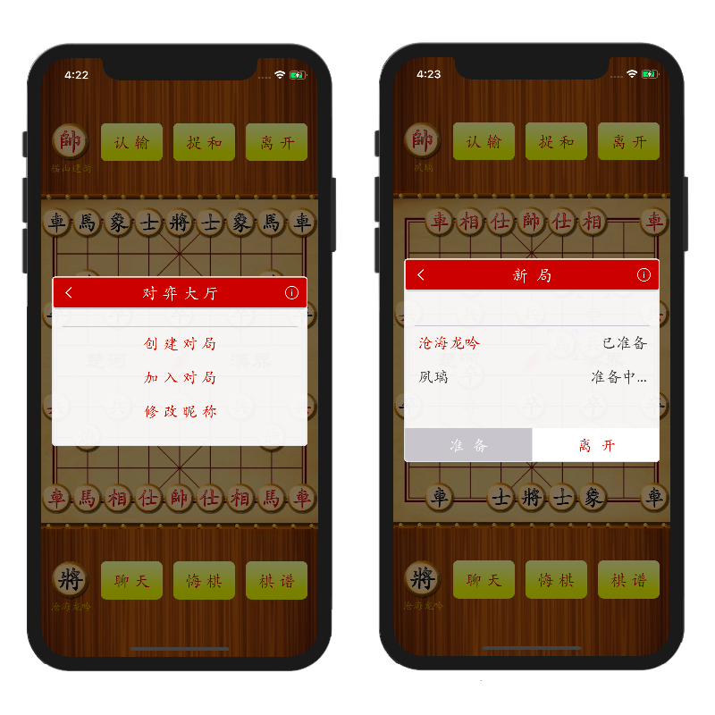

# 中国象棋
*中国象棋 - iOS App（C & Obj-C & Swift）*

## App 一览
### 启动页 & 主页

### 对弈模块

### 摆设棋局模块

### 棋谱模块

### 联机模块

***

## 开发记录
* 2017.10.11, 正式启动工程.
* 2018.2.24, 完成联机模块，开始开发AI.
* 2018.9.27, 可以 __按棋谱库走棋__，棋谱库目前较小，有待扩展。
* 2019.2.15, __调试完毕__，输出不稳定，原因很复杂。
* 2019.4.1, __AI不稳定性排查__，发现置换表、杀手着法、重复局面裁剪会造成不稳定性，将逐步排查。

## 功能一览
### 对弈模块
- 支持人机对弈，可以选择AI等级。
- 支持立即的悔棋，新局，设置。
- 支持反转棋盘，反向棋子。
- 支持背景音乐的开关。

### 摆设棋局模块
- 支持清除、初始化棋盘。
- 支持在合理的格点处移除、摆放一颗棋子。
- 支持载入棋谱进行对弈。

### 棋谱模块
- 支持棋谱的读(演示)，保存，删除。
- 支持棋谱的任意一步跳转，点击即可跳转到这一步的局面。
- 支持在当前局面跳转对弈。

### 联机模块
- 支持两人对弈，通过蓝牙或者局域网。
- 支持悔棋、认输、提和。
- 支持新局。

## App之AI一览
### 简单棋规
- 长将或长捉判负。
- 双方无进攻棋子判和。
- 50回合不吃子判和。
- 相同的局面出现多次判和。

### 棋谱库
- 命中棋谱库：AI搜索前，可以查询棋谱库中有没有当前局面对应的着法，如果有的话，就直接拿来用，否则，AI进行搜索。另外，命中不一定是严格的局面对应，可以是左右翻转、红黑翻转，一共尝试搜索4个局面。
- 扩充棋谱库：棋谱文件分为两种，由每一步记录是否有FEN串来区分的，如果有FEN串，则这样的文件可以用来扩充棋谱库，传入棋谱文件所在的目录路径，这样可以用大量棋谱文件来扩充棋谱库，后期可以搜集大师的比赛棋谱来增强棋力。步骤如下，1. [LunaRecordStack historyFileWithCode:YES]; 2. [LunaRecordVault expandVaultWithDirectory:@"棋谱文件所在的目录"]; 3. [LunaRecordVault writeToFile:@"棋谱库的保存路径"];

### 棋盘棋子表示
- 棋盘：长度为256的数组。
- 棋子：16-31为红方棋子，依次为帥、仕仕、相相、馬馬、車車、炮炮、兵兵兵兵兵，32-47为黑方棋子，类似。

### 着法生成
- 短程类：帥仕相馬兵，走法预生成数组，事先计算好的数据。
- 远程类：車炮，位行位列，以位数据为索引。

### 着法排序 
- 吃子着法：类似MVV排序。
- 不吃子着法：按历史表排序。

### 杀手着法
- 兄弟局面。仅限于同层，这两个局面的部分好的着法可能是一致的。
- 考虑什么样的着法？最好的着法或者引发裁剪的着法。

### 提前退出
- 和棋裁剪。双方无进攻棋子即可返回。
- 重复局面裁剪。如果与之前的局面重复了就直接评估。
- 杀棋裁剪。如果是达到最佳杀棋就直接返回。

### 哈希启发
- Zobrist Hash. 一种低概率冲突的键值产生法。
- Value. 满足一定条件，则可返回该值。
- Hash Move. 如果要进行着法生成，则可优先使用Hash Move。

### 搜索算法
- PVS. Alpha-Beta的改进算法，依赖于良序的着法顺序。
- 有机结合了各个功能部分。

### 局面评估
- 局面预评估：分析局面的状态, 判断局面处于开中局或是残局。开中、残局的子力估值是不一样的。
- 局面动态评估：在搜索树的叶结点进行动态评估，分为两部分，一是子力位置价值，二是动态估值，动态估值包括缺少仕相的惩罚，馬的控制、牵制、保护，車的威胁、牵制、保护、灵活度，炮的威胁、牵制、保护、空头炮/沉底炮、灵活度的评估。

## 传统AI的局限性
### 局限性
- 局面评估依赖于人类经验。总是需要不断人工完善。
- 置换表的不稳定性。当不是杀棋时，直接使用value的副作用，可能是输出不稳定的原因之一。
- 重复局面直接评估的不稳定性。重复局面可能是最顽强的对抗，可能是输出不稳定的另一原因。
- 其他高级技术的不稳定性。寂静搜索、空着裁剪、选择延伸的副作用（本App没有实现这些技术）。
- 知识与速度。需要在其中做权衡。

### 为什么本人浅尝辄止？
- 能力有限。2015年开始接触，至今才有这些积累，仍有很多不通透之处。
- 国内资料屈指可数。本人搜到的资料仅有[黄晨前辈的网站](http://www.xqbase.com/computer/eleeye_intro.htm)和兵河五四相关文献。
- 技术过时。和兵河五四的作者交流一番，本人实现的技术已经是十多年前的了，而且还是初级阶段的传统技术。
- 希望通过 __Deep Learning__ 来解决这个问题，参照 *__Alpha-Zero__*。

## 对现代AI的期待
- 普及化。在移动端有限的计算能力下，表现较好的效果。
- 自动化。不依赖过多的人类经验，自动提升棋力。
